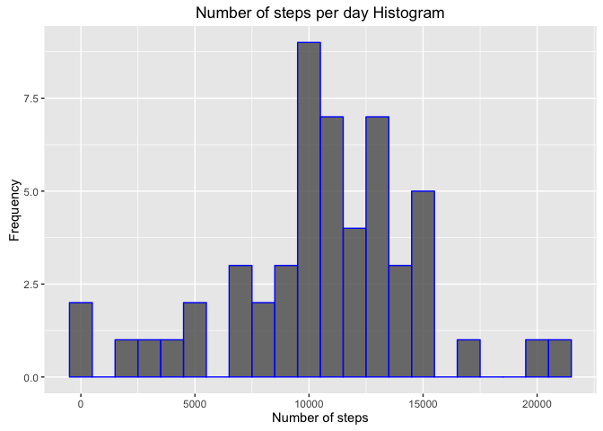
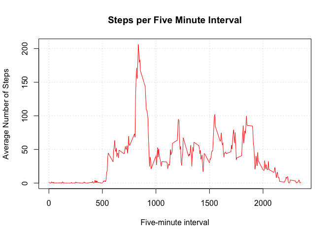
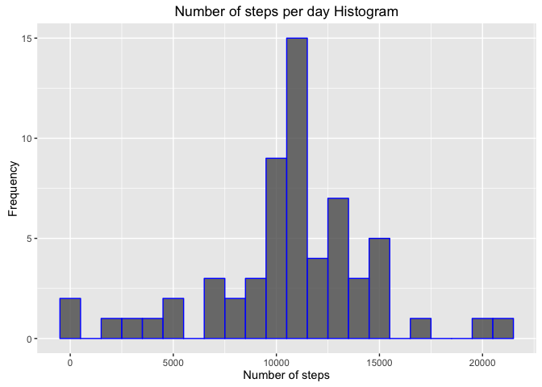
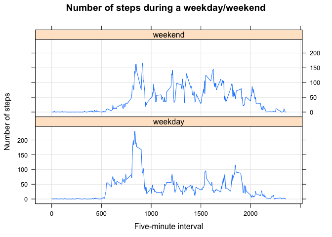

# Reproducible Research: Peer Assessment 1


## Loading and preprocessing the data

```r
#Method that improves the presentation of inline numbers
knitr::knit_hooks$set(inline = function(x) {
  knitr:::format_sci(x, 'md')
})
#Unzips the file from the repository
unzip("activity.zip")
#Loads the file into a dataframe
dataframe <- read.csv("activity.csv")
```


## What is mean total number of steps taken per day?

```r
#1. Calculate the total number of steps taken per day
day_steps  <- tapply(dataframe$steps,dataframe$date,sum)

#2. Perform a histogram of the number of steps taken per day
library(ggplot2)
qplot(day_steps[!is.na(day_steps)], 
      geom="histogram", 
      main="Number of steps per day Histogram",
      xlab = "Number of steps",
      ylab = "Frequency",
      col = I("blue"),
      alpha = I(0.8),
      binwidth = 1000)
```

<!-- -->

```r
#3. Compute the mean and median of the total number of steps taken per day
mean_steps <- mean(day_steps,na.rm = TRUE)
median_steps <- median(day_steps,na.rm = TRUE)
print(paste(c("Average Number of Steps: ",mean_steps),collapse=""))
```

```
## [1] "Average Number of Steps: 10766.1886792453"
```

```r
print(paste(c("Median Number of Steps: ",median_steps),collapse=""))
```

```
## [1] "Median Number of Steps: 10765"
```

The mean number of steps is 1.0766189&times; 10^4^ and the median 10765.

## What is the average daily activity pattern?

```r
#Retrieve the average amount of steps per 5 minute interval
average_steps  <- tapply(dataframe$steps,dataframe$interval,mean,na.rm=TRUE)

#1. Make a time series plot of the 5 minute interval and the average number of 
# steps taken, averaged across all days
plot(names(average_steps),average_steps,type="l",
     xlab = "Five-minute interval", 
     ylab = "Average Number of Steps",
     main = "Steps per Five Minute Interval",
     col = "red")
grid()
```

<!-- -->

```r
#2. Which 5-minute interval, on average across all days in the dataset, contains
#the maximum number of steps
interval <- as.numeric(names(which.max(average_steps)))
print(paste(c("Interval with maximum number of steps: ",interval),collapse=""))
```

```
## [1] "Interval with maximum number of steps: 835"
```

The five minute interval with the maximum number of steps is 835.

## Imputing missing values

```r
#1. Calculate and report the total number of missing values in the dataset
missing_values <- which(is.na(dataframe$steps))
total_missing <- length(missing_values)
print(paste(c("Number of missing values: ",total_missing),collapse=""))
```

```
## [1] "Number of missing values: 2304"
```

```r
#2. Devise a strategy for filling in all of the missing values in the dataset.
replacement <- average_steps[as.character(dataframe[missing_values,"interval"])]

#3. Create a new dataset that is equal to the original dataset but with the
#missing data filled in
new_dataframe <- dataframe
new_dataframe[missing_values,"steps"] <- replacement

#4. Make a histogram of the total number of steps taken each day;
#Calculate and report the mean and median total number of steps.
new_day_steps  <- tapply(new_dataframe$steps,new_dataframe$date,sum)

qplot(new_day_steps, 
      geom="histogram", 
      main="Number of steps per day Histogram",
      xlab = "Number of steps",
      ylab = "Frequency",
      col = I("blue"),
      alpha = I(0.8),
      binwidth = 1000)
```

<!-- -->

```r
new_mean_steps <- mean(new_day_steps)
new_median_steps <- median(new_day_steps)
print(paste(c("New average: ", new_mean_steps),collapse=""))
```

```
## [1] "New average: 10766.1886792453"
```

```r
print(paste(c("New median: ", new_median_steps),collapse=""))
```

```
## [1] "New median: 10766.1886792453"
```

The total number of missing values is 2304 - after imputing the 
average value of the five minute interval, the new average number of steps is
1.0766189&times; 10^4^ and the new median 1.0766189&times; 10^4^.

As a conclusion, imputing new values alters the distribution of the data as
observed by the new median value of steps.

## Are there differences in activity patterns between weekdays and weekends?

```r
#1. Create a new factor variable in the dataset with two levels - "weekday"
# and "weekend" indicating whether a given date is a weekday or weekend day
new_dataframe[,"Weekday"] <- weekdays(as.Date(new_dataframe$date))
condition <- new_dataframe[,"Weekday"] == "Saturday" |
    new_dataframe[,"Weekday"] == "Sunday"

new_dataframe[condition,"Weekday"] <- "weekend"
new_dataframe[!condition,"Weekday"] <- "weekday"

#Convert Weekday as a factor
new_dataframe[,"Weekday"] <- as.factor(new_dataframe[,"Weekday"])

#2. Make a panel plot containing a time series plot (i.e. 𝚝𝚢𝚙𝚎 = "𝚕") 
#of the 5-minute interval (x-axis) and the average number of steps taken, 
#averaged across all weekday days or weekend days (y-axis). 

#Split the frame into weekdays and weekends
split_frame <- split(new_dataframe,new_dataframe$Weekday)
#Compute the average for both
weekday <- tapply(split_frame[[1]]$steps,split_frame[[1]]$interval,mean)
weekend <- tapply(split_frame[[2]]$steps,split_frame[[2]]$interval,mean)

#Combine the average steps per weekend and weekday
intervals<-c(as.numeric(names(weekday)), as.numeric(names(weekend)))
steps<-c(unname(weekday), unname(weekend))
factors <- as.factor(c(rep("weekday", 
                           length(weekday)),
                       rep("weekend", 
                           length(weekend))))

#Final dataframe
final <- data.frame(interval = intervals, steps = steps, weekday = factors)

#Plot the panel
library(lattice)
xyplot(steps~interval|weekday,data=final,
       type=c("l","g"), 
       layout=c(1,2), 
       main = "Number of steps during a weekday/weekend",
       xlab = "Five-minute interval",
       ylab = "Number of steps")
```

<!-- -->

Observing the plot, we can see that during a weekday, the number of steps
is higher during the early part of the day, though the number of steps steadily
decreases until the end.

As for weekends, we can observe that we do not have a high peak of steps during
the early part of the day, but instead we have prolonged period of time
where the number of steps per five-minute interval is almost constant.
